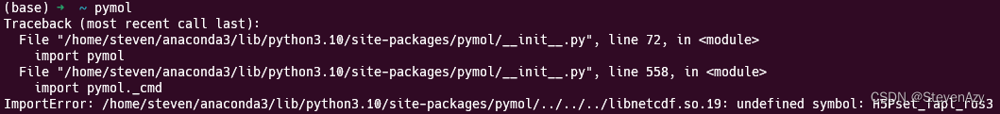
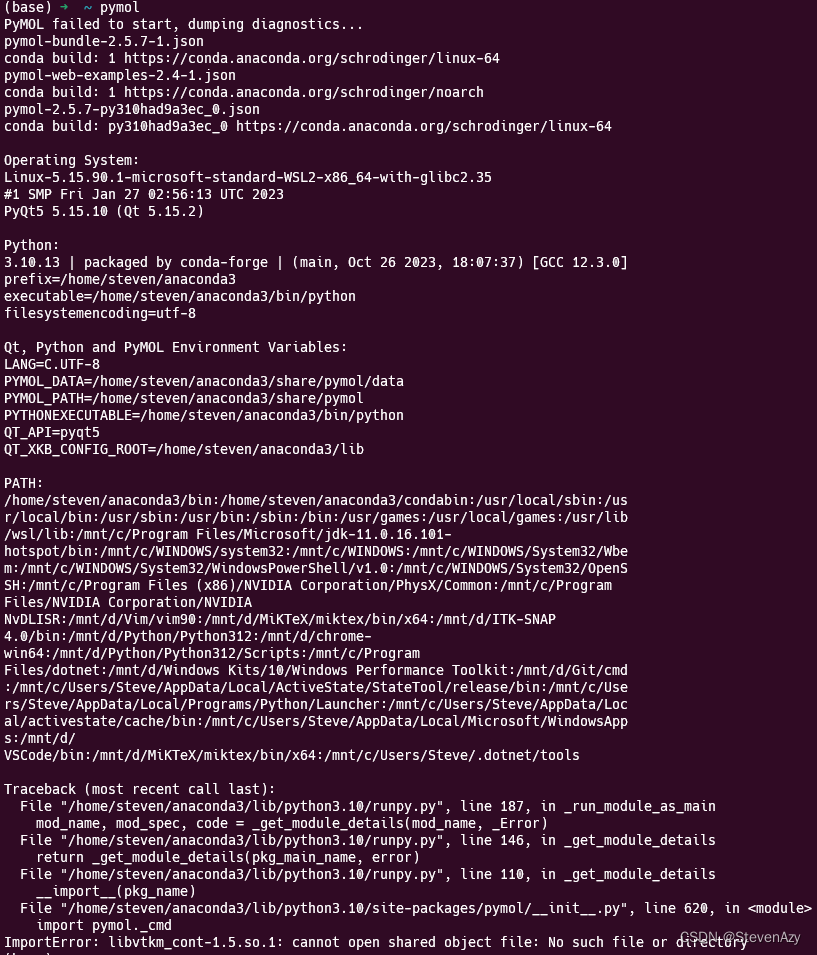
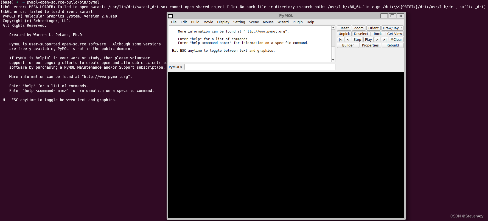

+++
title = "PyMOL安装"
date = 2023-11-08T22:57:05+08:00
images = []
tags = []
categories = []
draft = false
+++

### 背景
由于作者的研究方向是生物信息学，经常需要对一些生物分子进行操作，需要一个可视化的操作软件，这个软件就是`PyMOL`。但是最近在安装PyMOL时出现了不少问题，而且很多问题在网上搜索都是没有办法解决的，所以想写一个教程帮助一下有需要的人。
### 介绍
`PyMOL`是一个开放源码，由用户赞助的分子三维结构显示软件。`PyMOL`适用于创作高质量的小分子或是生物大分子（特别是蛋白质）的三维结构图像。
### 安装环境
- WSL(Windows Subsystem for Linux)
- Ubuntu 22.04.3 LTS
### 安装过程
1. 使用`Ubuntu` 自带的`apt`进行安装。命令是`sudo apt install pymol`，安装完成之后，运行`pymol`出现下面的问题。
网上寻找了一番，找到了一个[相关解答](https://github.com/schrodinger/pymol-open-source/issues/178)，但是按照该解答进行操作，还是没有解决这个问题。
2. 第一种安装方式失败之后，决定使用`conda`进行安装。命令是`conda install -c conda-forge -c schrodinger pymol-bundle`，安装完成之后，运行出现了新的问题。
也是搜索一番，找到一个[相关解答](https://github.com/schrodinger/pymol-open-source/issues/304)，同样，按照这个解答进行操作，没有解决。
3. 经过上面两种在`Ubuntu`上安装软件的方式，作者决定直接从源码安装，做最后的尝试。从源码安装的教程在PyMOL的Wiki上已经给出来了，直接点击该[链接](https://pymolwiki.org/index.php/Linux_Install)就可以看到啦！
最后放上安装成功的图片。
### 总结
我之前已经安装过好几次`PyMOL`了，在`Windows`和`MacOS`上都是直接安装成功了。主要还是因为之前的安装都是从官网上直接下载安装包，一键傻瓜式安装。这次的安装遇到的这些问题，其实并没有解决，所以如果有知道解决办法的朋友，可以直接联系我，我也想弄清楚因为什么。

### 参考
`PyMOL`的维基百科：https://zh.wikipedia.org/wiki/PyMOL
`PyMOL`教程：https://pymolwiki.org/index.php/Main_Page

​